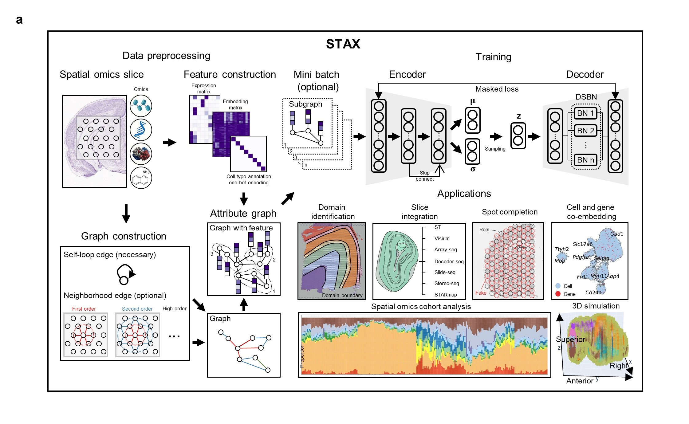

.. CAMEX documentation master file, created by
   sphinx-quickstart on Sun Dec 25 15:28:06 2022.
   You can adapt this file completely to your liking, but it should at least
   contain the root `toctree` directive.

Multi-task spatial omics analytics for high-precision modeling of tissue architecture with STAX
====================================================================================================================================================

.. toctree::
   :maxdepth: 1
   
   1_STAX_single_slice
   2_STAX_multi_slice
   3_STAX_cohort
   4_STAX_spot_completion
   5_STAX_cell_gene_coembedding
   6_STAX_generate_high_resolution_3D_point_cloud
   
   
Overview of STAX
========================     

   
    
**a**. The rapid advancement of spatial omics technologies has transformed biomedical research by revealing the molecular
and cellular organization of biological systems. However, current analyses often rely on multiple task-specific tools with
heterogeneous preprocessing pipelines and hyperparameter tuning, which can reduce consistency. Here, we present STAX,
a unified multi-task learning framework for diverse spatial omics data. STAX integrates a graph attention network-based
variational autoencoder with domain-specific batch normalization, subgraph sampling, and masked reconstruction loss
within a single architecture. STAX supports spatial domain identification across omics modalities, multi-slice integration
across technologies and resolutions, cohort-level analysis of hundreds of tissue slices, cell-gene co-embedding, expression
denoising, and spatial spot completion. We further extend these functions to three-dimensional spatial omics by constructing
inter-slice spatial graphs, enabling integrated analysis and computational generation of virtual slices from 3D tissue data.
   
Installation
============ 

It's recommended to create a separate conda environment for running STAX:

.. code-block:: python

   #create an environment called CAMEX
   conda create -n STAX python==3.11
   #activate your environment
   conda activate STAX

Install all the required packages.

.. code-block:: python

   conda install cudatoolkit=11.6 -c conda-forge
   pip install torch==1.13.1+cu116 torchvision==0.14.1+cu116 torchaudio==0.13.1 --extra-index-url https://download.pytorch.org/whl/cu116
   pip install dgl-cu116 -f https://data.dgl.ai/wheels/repo.html

The other versions of pytorch and dgl can be installed from
[torch](https://pytorch.org/) and [dgl](https://www.dgl.ai/pages/start.html).

Clone the repository.

.. code-block:: python

   git clone https://github.com/zhanglabtools/STAX.git
   cd STAX

	
.. code-block:: python

   cd STAX
   python setup.py bdist_wheel sdist
   cd dist
   pip install stax-0.0.1-py3-none-any.whl

   
Citation
========
Multi-task spatial omics analytics for high-precision modeling of tissue architecture with STAX
github:
https://github.com/zhanglabtools/STAX
https://github.com/CocoGzh/STAX
